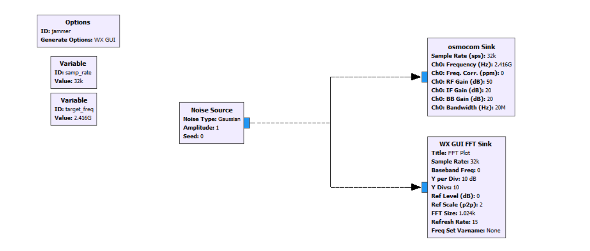
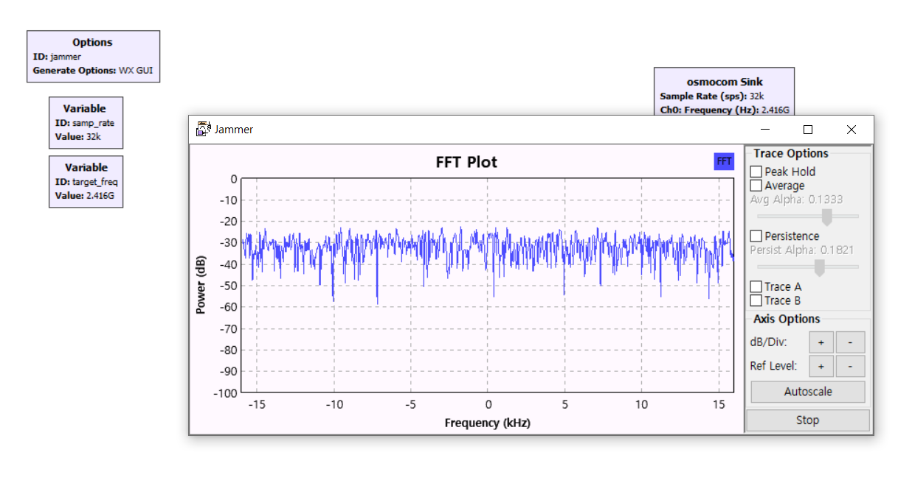
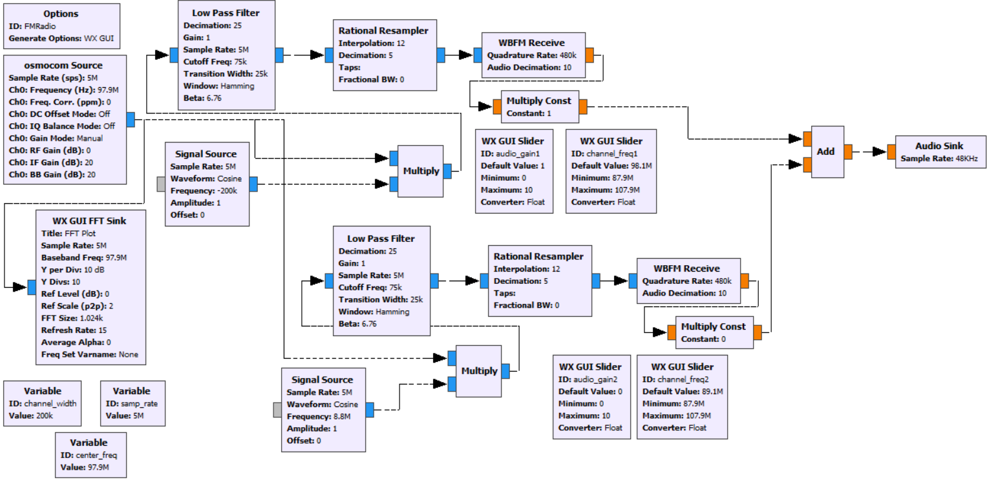
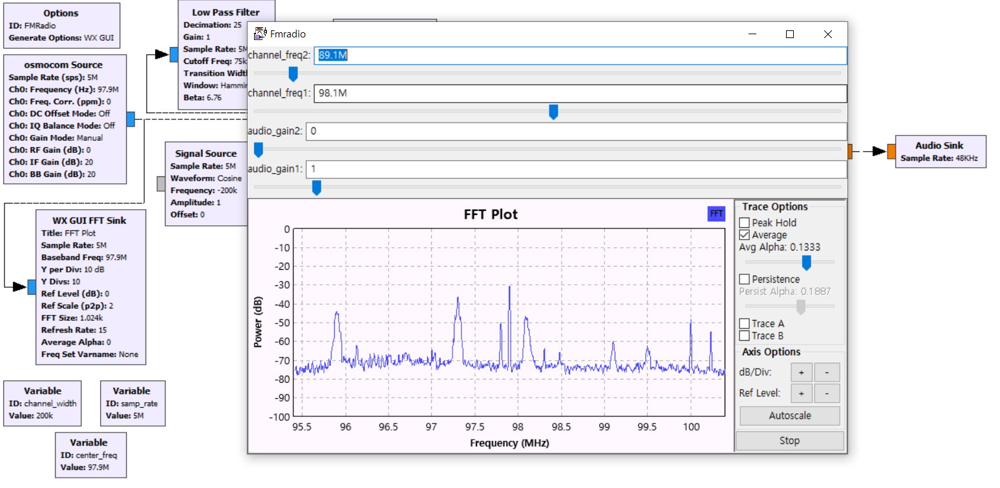

# Project Overview
This project aims to demonstrate our understanding of configuring SDR and system environment. Our project is mainly divided into 2 parts: Radio Frequency Jamming (Disrupting WiFi/LTE Connections) and receive FM Radio signals using SDR devices.

## Project Envrioment Configuration
GNURadio 3.7.11 on Windows 10 OS and HackRF One SDR Device

## Mini RF Jammer

#### Background
There are cases when wireless systems need to be forcefully shut down. For instance, restricting the use of wireless systems is necessary in the military due to security threats. In order to disrupt wireless connections, Radio Frequency Jamming is used. RF Jamming is one of the simple methods that defeat wireless systems. It can forcefully disable wireless connections of nearby devices that use radiofrequency by sending out overpowering signals to nearby, which drowns out the regular wireless frequencies and nullifies the >nearby wireless connections.

#### GRC Flowgraph
   
#### GRC Graph

#### Demo Video

## FM Radio Receiver

#### Background
Radio broadcasting using frequency modulation (FM) launched in the United States after Edwin Armstrong’s invention in 1933. The wide-band FM is now used all over the world, providing accurate reproduction of the sound over broadcast radio. FM radio stations’ radio frequencies  can be intercepted in the air with SDR devices such as Hackrf One. This way, radio stations can be accessed easily.

#### GRC Flowgraph
   
#### GRC Graph

#### Demo Video

